# LMS Learning Management System

## Overview

This project is a web application that includes both frontend and backend components. The frontend is built using React, while the backend is powered by Express.js and MongoDB.

View live site [here](https://learning-management-system-by-natan.onrender.com)
!(dashboard)(./screenshots/instructorDashboard.JPG)

## Table of Contents

- [Frontend](#frontend)
  - [Pages](#pages)
- [Backend](#backend)
  - [Routes](#routes)
- [Screenshots](#screenshots)
- [Setup](#setup)
- [Contributing](#contributing)
- [License](#license)

## Frontend

The frontend is structured using React components and React Router for navigation. Below are the main pages available in the application:

### Pages

1. **Home Page**
   - Path: `/home`
   - Component: `StudentHomePage`
   - Description: The landing page for students.
   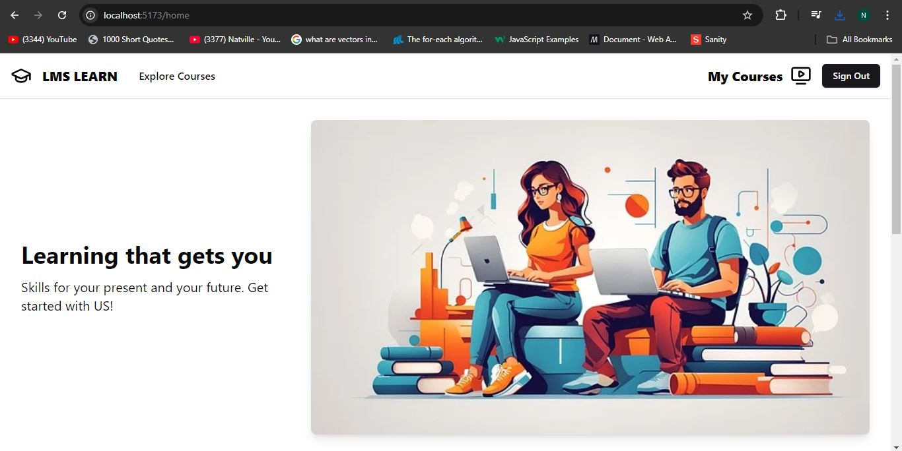 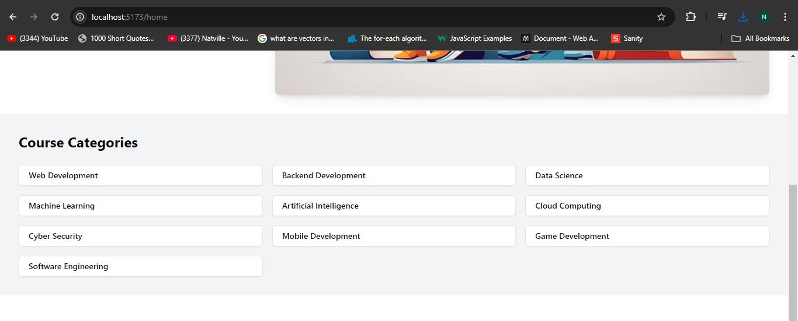 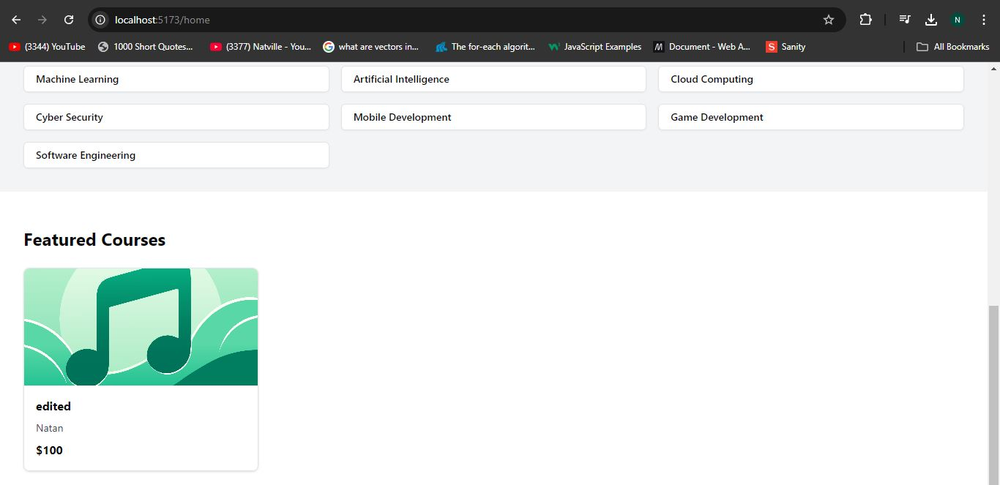

2. **Courses Page**
   - Path: `/courses`
   - Component: `StudentCourses`
   - Description: Displays a list of courses available to the student.
   - 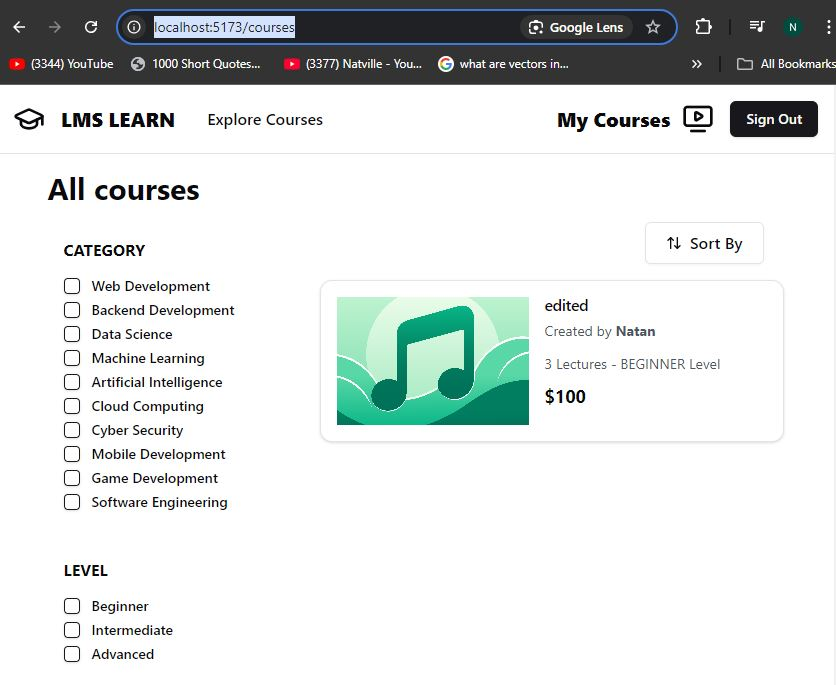

3. **Course Details Page**
   - Path: `/course/details/:id`
   - Component: `StudentCourseDetailsPage`
   - Description: Shows detailed information about a specific course.
   - 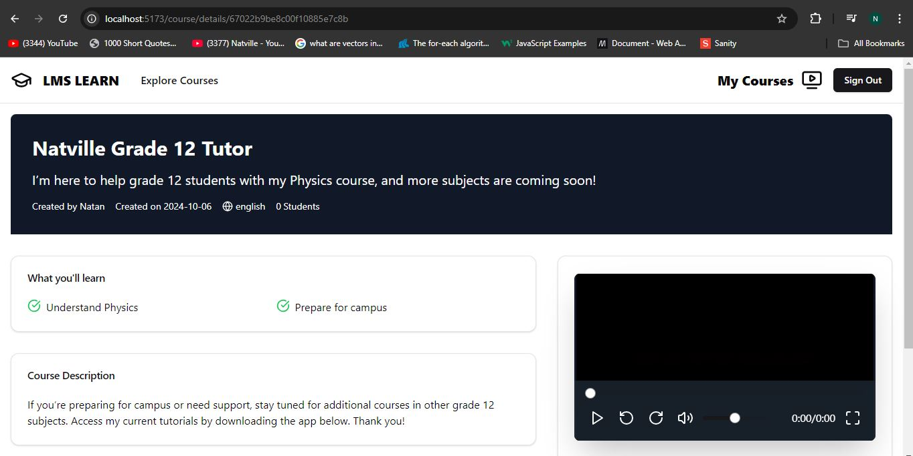
   - 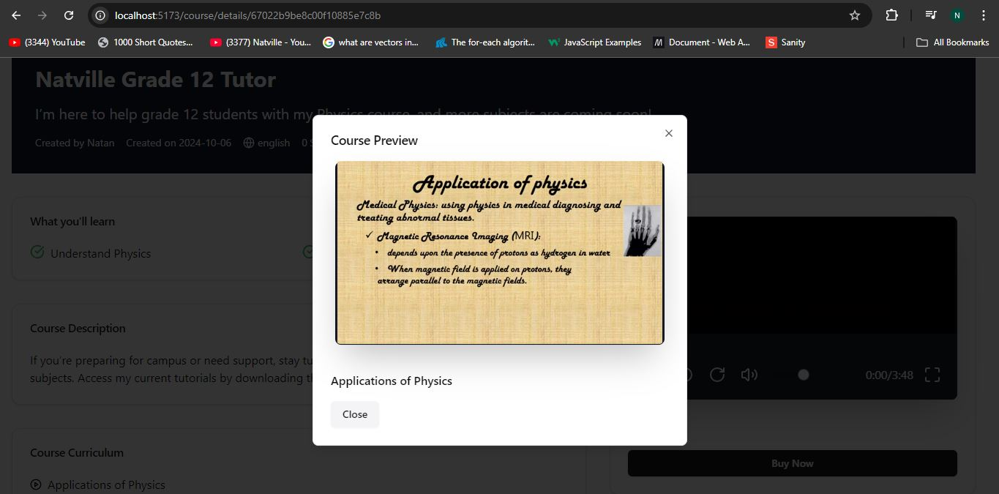

4. **Authentication Page**
   - Path: `/auth`
   - Component: `AuthPage`
   - Description: Handles user authentication.
    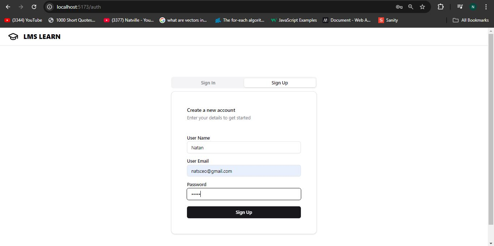
     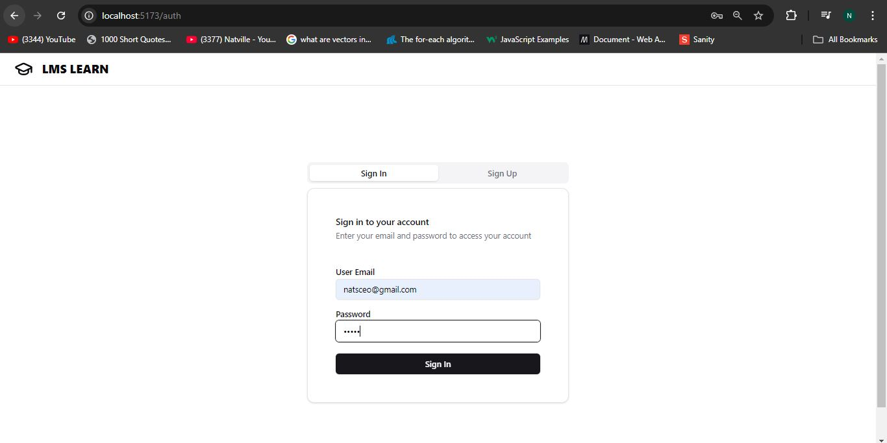

5. **Instructor Dashboard**
   - Path: `/instructor`
   - Component: `InstructorDashboard`
   - Description: Dashboard for instructors to manage courses.
    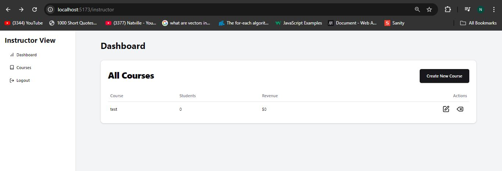

6. **Add New Course Page**
   - Path: `/instructor/create-new-course`
   - Component: `AddNewCoursePage`
   - Description: Allows instructors to create new courses.
    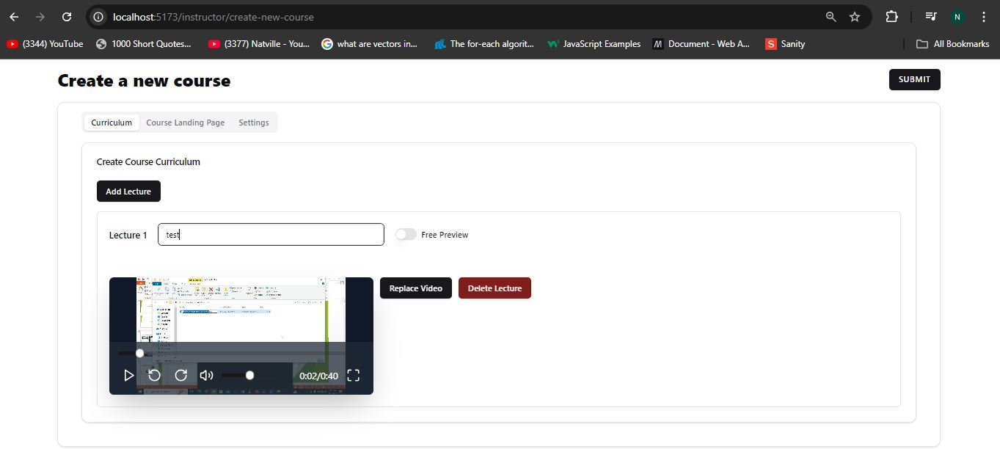

7. **Edit Course Page**
   - Path: `/instructor/edit-course/:id`
   - Component: `AddNewCoursePage`
   - Description: Enables instructors to edit existing courses.
    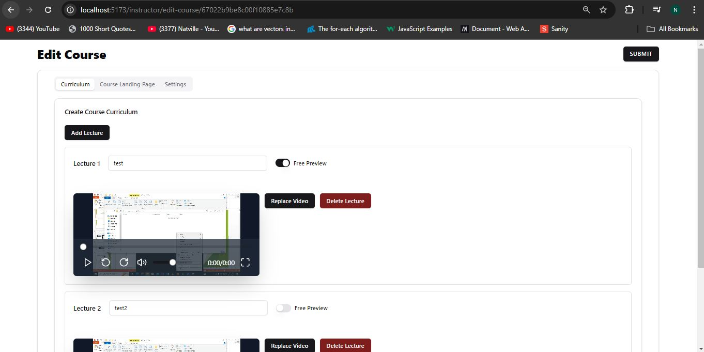

## Backend

The backend is built using Express.js and connects to a MongoDB database. Below are the main routes available:

### Routes

1. **Student Course Routes**
   - Base Path: `/student/course`
   - Endpoints:
     - `GET /get`: Retrieves all courses available for students.
     - `GET /detail/:id`: Retrieves detailed information about a specific course.

2. **Authentication Routes**
   - Base Path: `/auth`
   - Endpoints:
     - `POST /register`: Registers a new user.
     - `POST /login`: Logs in an existing user.
     - `GET /check-auth`: Checks if the user is authenticated.

3. **Instructor Course Routes**
   - Base Path: `/instructor/course`
   - Description: Handles course-related operations for instructors.

## Setup

To set up the project locally, follow these steps:

1. Clone the repository.
2. Navigate to the project directory.
3. Install dependencies for both frontend and backend using `npm install`.
4. Set up environment variables in a `.env` file in `backend` folder.
5. Run the backend server using `cd backend && npm start`.
6. Start the frontend application using `npm start` in the `frontend` directory.

## Libraries used
### Server side
- bcrypt.js
- cloudinary
- cors
- express
- mongoose
- dotenv
- jsonwebtoken
- multer
- paypal-rest-sdk

### Client side
- axios
- react-router-dom